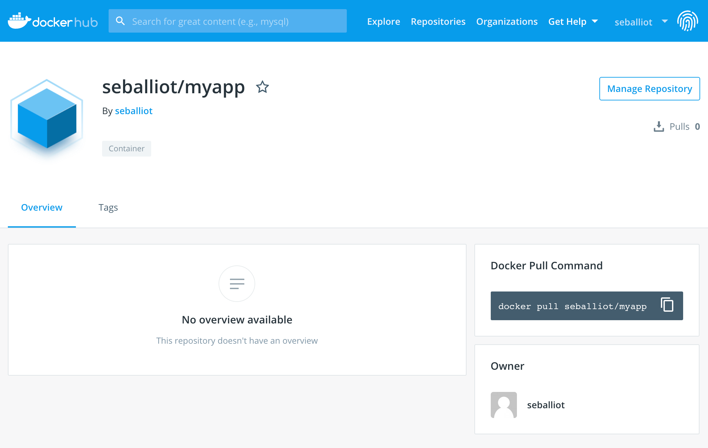
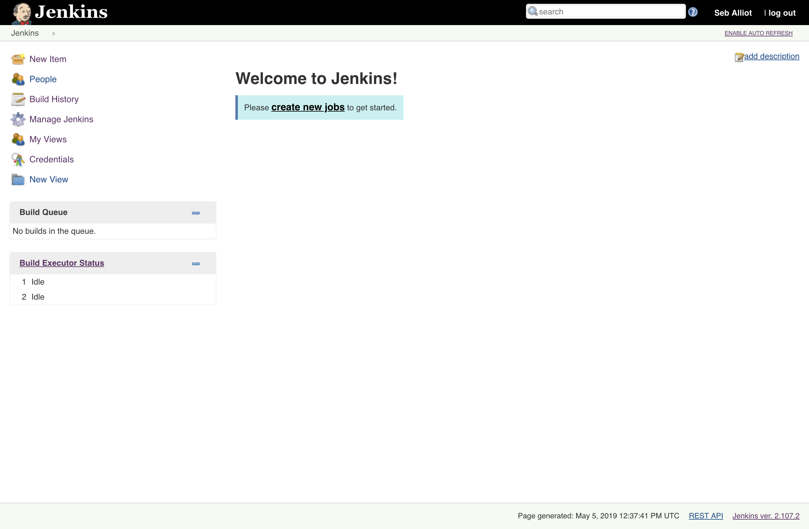
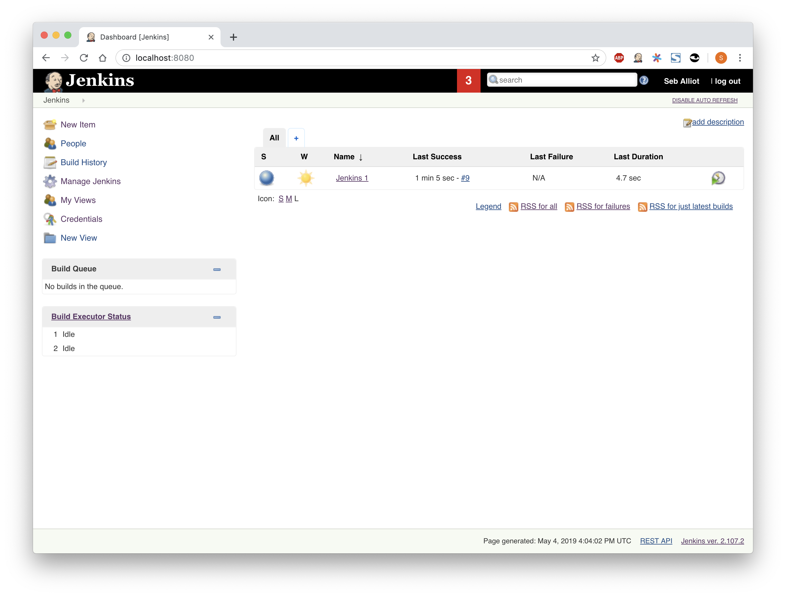
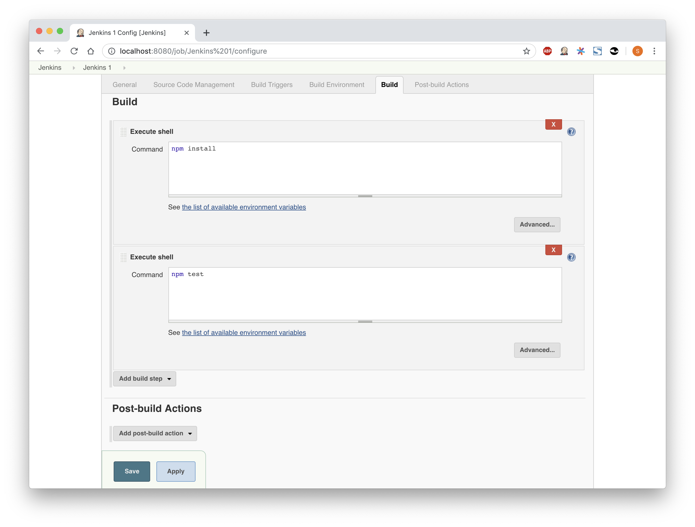
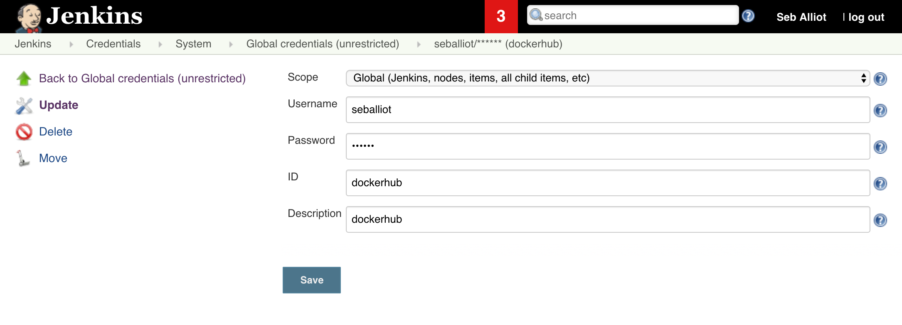
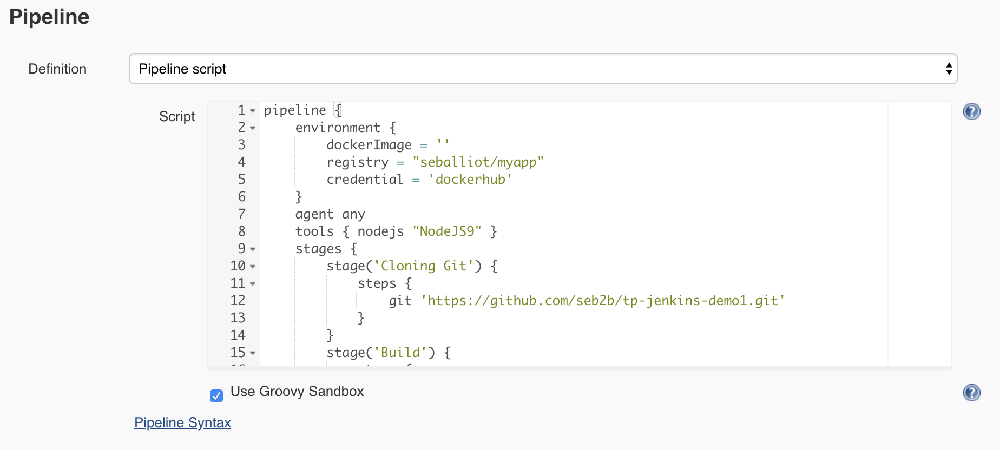

## Énoncé du TP

##### Docker - Jenkins

- 1/ npm install => gestion des dépendances
- 2/ npm test => tests unitaires
- 3/ packaging => créer une image docker
- 4/ publier l'application => envoyer sur le registry docker
- 5/ déploiement (nouveau job)

## Réalisation : Instructions et étapes

#### Configurations
Au préalable, j'ai configuré le projet NodeJS demo et je l'ai poussé sur mon Github : [https://github.com/seb2b/tp-jenkins-demo1.git](https://github.com/seb2b/tp-jenkins-demo1.git). C'est ce projet qui va être utiliser pour ce TP.

J'ai également créé un nouveau repository sur mon dockerhub que j'ai appelé ```myapp```, qui va permettre à ce que je publie mon application et que je l'envoie sur la registery de docker via ce repository.



#### Commandes

J'instancie un nouveau container à partir de l'image *jenkins-docker* de gustavoapolinario en précisant le port 8080.
```bash
$ docker run --name jenkins-docker -p 8080:8080 -v /var/run/docker.sock:/var/run/docker.sock gustavoapolinario/jenkins-docker
```

L'image [gustavoapolinario/jenkins-docker](https://hub.docker.com/r/gustavoapolinario/jenkins-docker/dockerfile) instancie un container Jenkins avec Docker déjà installé, primordial pour ce TP. J'aurai pu partir d'une image perso avec un Dockerfile mais j'ai trouvé cette image et elle est parfaitement adapté donc le résultat est le même.

Quand on ouvre un navigateur à l'adresse [http://localhost:8080/](http://localhost:8080/) (après avoir configuré le compte et installé les plugins):



Ensuite, j'ai créé un nouveau job de type *Freestyle Project* en précisant : 
- Source Code Management : Git (l'url du projet NodeJS demo)
- Build Triggers : Build peridically (H/5 * * * *) afin de lancer le job toutes les 5min
- Build Environment : Provide Node & npm bin/ folder to PATH (NodeJS9 que j'ai préalablement installé)
- Build : Execute shell : ``` npm install ```

Après validation et planifier le build du job, voici le résultat : (qui se build toutes les 5min)



J'ai ensuite modifié le job en rajoutant une commande shell pour réaliser les tests unitaires: 
- Build : Execute shell : ``` npm test ```



Le job ```Jenkins 1``` fonctionne correctement.

Cependant après réflexion et documentation, j'ai décidé de partir sur la création d'une pipeline. Celà va permettre d'orchestrer des activités de longues durées s'étendants sur plusieurs agents de construction.
Ce job de type Pipeline comporte plusieurs étapes, allant du clonage du projet Git jusqu'au déploiement sur la registery Docker. 

#### Mise en place du job Pipeline

Avant tout j'ai créé un credential (certificat) dans Jenkins afin de pouvoir configurer l'environnement et faire le lien avec mon repo sur le hub de Docker.



Avec les informations d’identité (credentials) et le repository dockerhub créés, Jenkins peuvent envoyer l’image du docker construite au dockerhub (notre repo docker).

#### Le script de la pipeline se décompose en plusieurs parties :

Configuration de l'environnement avec 3 variables :

- ```myImage``` : informations de l'image Docker
- ```registery``` : mon repository sur le hub de Docker
- ```credential``` : certificat
 
```
environment {
    myImage = ''
    registry = "seballiot/myapp"
    credential = 'dockerhub'
}
```

On précise que le job sera exécuté dans n'importe quel agent Jenkins :
```
agent any
```

On indique l'outil nodejs nommé *NodeJS9* (créé dans Jenkins > GlobalToolConfiguration). Cette ligne est nécessaire pour les prochains scripts. 
```
tools { nodejs "NodeJS9" }
```

Initialisation des étapes du pipeline
```
stages {
    ... 
}
```

Création d'une nouvelle étape nommé "Clonage du projet Git" qui va clone le projet Git contenant le Dockerfile
```
stage('Cloning Git') {
    steps {
        git 'https://github.com/seb2b/tp-jenkins-demo1.git'
    }
}
```

Création d'une nouvelle étape qui va exécuter une script shell pour la gestion des dépendances
```
stage('Install dependencies') {
    steps {
        sh 'npm install'
    }
}
```

Création d'une nouvelle étape qui va exécuter une script shell pour les tests unitaires
```
stage('Test') {
    steps {
        sh 'npm test'
    }
}
```

Exécute le docker build et utilise le numéro de build de Jenkins dans le tag de docker
```
stage('Packaging') {
    steps{
        script {
            myImage = docker.build registry + ":$BUILD_NUMBER"
        }
    }
}
```

Push l'image docker qui a été build sur le dockerhub
```
stage('Deploy Image') {
    steps{
        script {
            docker.withRegistry( '', credential ) {
                myImage.push()
            }
        }
    }
}
```

Après la construction et le déploiement, supprime l'image pour nettoyer l'espace sur le serveur
```
stage('Remove Unused docker image') {
    steps{
        sh "docker rmi $registry:$BUILD_NUMBER"
    }
}
```

#### Pipeline complète :

```
pipeline {
    environment {
        myImage = ''
        registry = "seballiot/myapp"
        credential = 'dockerhub'
    }
    agent any
    tools { nodejs "NodeJS9" }
    stages {
        stage('Cloning Git') {
            steps {
                git 'https://github.com/seb2b/tp-jenkins-demo1.git'
            }
        }
        stage('Build') {
            steps {
                sh 'npm install'
            }
        }
        stage('Test') {
            steps {
                sh 'npm test'
            }
        }
        stage('Packaging') {
            steps{
                script {
                    myImage = docker.build registry + ":$BUILD_NUMBER"
                }
            }
        }
        stage('Deploy Image') {
            steps{
                script {
                    docker.withRegistry( '', credential ) {
                        myImage.push()
                    }
                }
            }
        }
        stage('Remove Unused docker image') {
            steps{
                sh "docker rmi $registry:$BUILD_NUMBER"
            }
        }
    }
}
```



Après avoir sauvegardé et exéctué, le build est terminé et l'image est envoyé sur la registery Docker.

Il suffit ensuite de se connecter sur l'instance Google Cloud Platform en SSH et de récupérer ce que l'on vient de push sur le repository : 

```bash
$ docker pull seballiot/myapp
$ docker container run seballiot/myapp
```

---

Je n'ai pas réussi à faire le TP jusqu'au bout, à savoir accéder au projet NodeJS sur l'instance. 
Néanmoins j'ai fais ce que j'ai pu pour expliquer au mieux ce que j'ai voulu faire et ce que j'ai fais pour réaliser les 5 étapes.